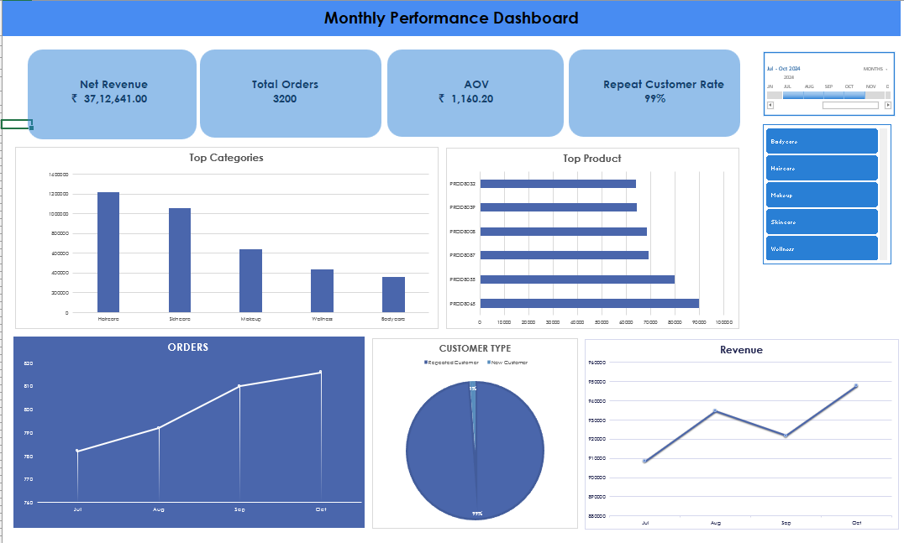

# E-commerce- Monthly Performance & Retention Snapshot Dashboard

*This dashboard provides a monthly snapshot of key E-commerce performance and retention metrics using real-world structured data. It is designed for founders/marketers who want quick insights into revenue, customer behavior, and category performance.*

## **📊Key Metrics (KPI Cards)**

- **Net Revenue:** ₹37,12,641
- **Total Orders:** 3,200
- **AOV:** ₹1,160
- **Repeat Customer Rate:** 99%

---

## 📈 **Highlights**

- Revenue and orders grew steadily month-over-month
- Haircare & Skincare drove the majority of revenue
- Strong repeat customer contribution indicates high loyalty
- A few top SKUs generated a major share of overall sales
- Steady upward revenue curve over the last 4 months

---

## 🛒 **Category Insights**

- **Haircare** → highest-performing category
- **Skincare** → strong secondary contributor
- **Makeup** → moderate performance
- **Wellness & Bodycare** → underperforming compared to others

---

## 👥 **Customer Insights**

- Majority of revenue came from **returning customers**
- Very high repeat rate (99%) signals strong retention
- New customer acquisition appears low → possible top-funnel gap

---

## ⚠️ **Risk Flags**

- AOV slightly lower vs revenue growth → potential discount dependency
- Heavy reliance on a handful of SKUs → product concentration risk
- Low new-customer share → long-term growth may slow

---

## 🎯 **Recommendations (Next Steps)**

- Double down on top categories with targeted campaigns
- Improve acquisition channels to balance new vs returning customers
- Push loyalty/retention flows to maintain strong repeat rate
- Consider expanding SKU variety in high-performing categories
- Review pricing strategy for best-selling SKUs
- Investigate underperforming categories for repositioning or phase-out

---

## 🖥️ **Dashboard Preview**

## 📎 **Download the Full Excel Dashboard**

[https://github.com/SakshiSingh-26/Ecommerce-KPI-Dashboard](https://github.com/SakshiSingh-26/Ecommerce-KPI-Dashboard)

## ✨ **Summary**

The e-commerce store is showing strong momentum, led by loyal returning customers and consistent revenue growth. Focusing on category optimization, customer acquisition, and SKU diversification can build on this month’s strong performance.

---